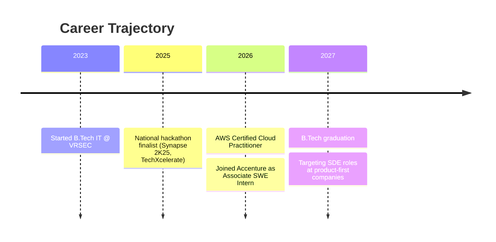

<div align="center">


</div>

<div align="center">

```
╔══════════════════════════════════════════════════════════════════╗
║  NITHISH_OS  ::  boot sequence                                     ║
╠══════════════════════════════════════════════════════════════════╣
║  [ OK ]  loading /kernel/dsa.ko ................ 300+ problems     ║
║  [ OK ]  mounting /srv/backend ................. Flask · Node.js   ║
║  [ OK ]  starting ai-integration.service ....... LLMs · RAG        ║
║  [ OK ]  linking /usr/lib/frontend .............. React · Tailwind ║
║  [ OK ]  verifying credentials .................. AWS CCP          ║
║  [ OK ]  spawning process: accenture-intern ..... PID 2026         ║
║  [DONE]  nithish_os ready in 0.42s                                  ║
╚══════════════════════════════════════════════════════════════════╝
```

</div>

<br>

<table align="center">
<tr>
<td width="50%" valign="top">

### ```whoami```

```yaml
name:        Nithish Kumar Daruvuri
role:        Software Engineering Undergraduate
focus:       Full-Stack + AI-Integrated Systems
institution: VRSEC, Vijayawada  (B.Tech IT, CGPA 8.5/10)
timeline:    Sep 2023 → May 2027
currently:   Associate SWE Intern @ Accenture, Bengaluru
languages:   Java · Python · JavaScript (ES6+)
shell:       always debugging in production (jk... mostly)
```

</td>
<td width="50%" valign="top">

### ```neofetch```

```
    ___         _  __   _     __       ⟶ OS: NithishOS 2.7 LTS
   / _ \  __ __ (_)/ /_ (_)___/ /       ⟶ Host: VRSEC Vijayawada
  / , _/ / // // // __// // __/         ⟶ Uptime: 3 yrs (2023–2027)
 /_/|_|  \_,_//_/ \__//_/\__/           ⟶ Shell: bash + brain.exe
                                         ⟶ DE: VS Code (Cursor-piloted)
  ┌─────────────────────────┐           ⟶ Terminal: Java · Python
  │ ■ Java   ■ Python        │           ⟶ CPU: 300+ DSA problems solved
  │ ■ JS     ■ SQL           │           ⟶ Memory: HackerRank Gold (Java)
  └─────────────────────────┘           ⟶ Theme: Cyberpunk-Terminal-Dark
```

</td>
</tr>
</table>

---

<div align="center">

## 📡 &nbsp; `cat /var/log/current_status.log`

**Software Engineering undergraduate** building full-stack applications and REST APIs with **Flask, Node.js, and MongoDB**, with a growing focus on **AI-integrated systems** — search relevance, LLM-based agents, and retrieval pipelines. Currently shadowing enterprise monitoring workflows on the **Anglo American account at Accenture**, while completing Accenture's Generative AI learning program. National-hackathon finisher, 300+ DSA problems deep, and an AWS Certified Cloud Practitioner.

</div>

---

## 🧬 &nbsp; `system.tech_stack --visualize`

<div align="center">

**Core Languages**


**Frameworks · Runtime**


**Data · Infra**


**AI / Gen AI Tooling**

&nbsp;


</div>

---

## 💼 &nbsp; `ps -ef | grep experience`

<table>
<tr>
<td width="8%" align="center">🏢</td>
<td>

**Associate Software Engineer Intern** — Accenture, Bengaluru
`June 2026 → Present`
- Shadowing the enterprise monitoring workflow on the **Anglo American** engagement to learn how large-scale applications are observed and maintained in production.
- Completing Accenture's **Generative AI learning program** — deepening understanding of LLMs, prompt engineering, and AI agents, and exploring their application to enterprise systems.

</td>
</tr>
</table>

---

## 🚀 &nbsp; `ls -la ./featured_projects/`

<table>
<tr>
<td width="50%" valign="top">

### 🔎 Search Relevance Optimizer
`Python` `FastAPI` `OpenSearch` `spaCy` `Sentence-Transformers`

An e-commerce search engine built with a team to surface the *right* products even through typos or natural-language queries — not just exact keyword matches.

- Query understanding via **spaCy**, spelling correction via **SymSpell**
- Semantic matching via **Sentence Transformers**
- Hybrid retrieval combining **BM25 + kNN** on **OpenSearch**
- Validated against **400+ search queries**

[`→ Repository`](https://github.com/Nithish0204) &nbsp;|&nbsp; [`→ Live Demo`](https://search-relevance-optimizer-six.vercel.app)

</td>
<td width="50%" valign="top">

### 🎓 Centralized Learning Management System
`React` `Node.js` `Express.js` `MongoDB`

A unified LMS where students access courses/assignments while instructors and admins manage learning resources — **3 distinct user roles**, one platform.

- **React** frontend, **Node.js/Express** backend
- **JWT + RBAC** for secure, role-based access
- **Cloudinary** for course media storage
- **MongoDB** for persistent course data

[`→ Repository`](https://github.com/Nithish0204) &nbsp;|&nbsp; [`→ Live Demo`](https://github.com/Nithish0204)

</td>
</tr>
<tr>
<td width="50%" valign="top">

### 🧠 Lumina — AI Mental Health Companion
`Python` `Flask` `Whisper` `ElevenLabs`

An AI companion providing emotional support through personalized text and voice conversations, adapting to the user's chosen relationship type.

- **Gemma 3** for response generation
- Custom **emotion detection** model
- **Whisper** for speech-to-text
- **ElevenLabs** for voice synthesis + cloning
- **6 relationship types** across **2 languages**

[`→ Repository`](https://github.com/Nithish0204) &nbsp;|&nbsp; [`→ Live Demo`](https://github.com/Nithish0204)

</td>
<td width="50%" valign="top">

### 🥗 AI Nutrition & Dietary Assessment Tool
`Python` `TensorFlow` `Gemini API`

Point your camera at food, get instant nutrition breakdowns — calories, protein, carbs, fats, and more.

- **TensorFlow** model for food recognition
- **Google Gemini API** for insights & recommendations
- **Nutritionix API** for detailed nutrition data
- Covers **100+ food categories**

[`→ Repository`](https://github.com/Nithish0204)

</td>
</tr>
</table>

---

## 📊 &nbsp; `top -o github_activity`

<div align="center">


</div>

<details>
<summary><b>🏆 expand: trophy_case.json</b></summary>
<br>
<div align="center">

</div>
</details>

---

## 🏅 &nbsp; `cat achievements.log`

```diff
+ 1st Runner-Up — Synapse 2K25 National Hackathon (full-stack team solution)
+ Top 7 / 100+ teams — TechXcelerate, BITS Goa
+ 300+ problems solved on LeetCode
+ HackerRank Gold Badge — Java
+ AWS Certified Cloud Practitioner — Amazon Web Services (May 2026)
```

---

## 🛰️ &nbsp; `roadmap.exec()`



---

<table align="center">
<tr>
<td width="50%" valign="top">

### 🧭 coding_philosophy.md

> Understand the problem before touching the keyboard.
> Ship things that work end-to-end, not just in theory.
> AI is a tool that accelerates thinking — not a replacement for it.
> Every project should teach you something you didn't know going in.

</td>
<td width="50%" valign="top">

### ⚡ fun_facts.arr

```json
[
  "debugs faster with coffee.exe running",
  "reads model architectures for fun",
  "300+ LeetCode grind, zero shortcuts",
  "believes clean READMEs > clean code (kidding... mostly)"
]
```

</td>
</tr>
</table>

---

## 📡 &nbsp; `nc -v contact.terminal 443`

<div align="center">

```
┌──────────────────────────────────────────────┐
│  connecting to nithish_daruvuri@network...    │
│  handshake: SUCCESS                           │
│  channels open below ↓                        │
└──────────────────────────────────────────────┘
```

[](https://nithishdaruvuri.vercel.app)
[](https://www.linkedin.com/in/nithishdaruvuri/)
[](https://github.com/Nithish0204)
[](https://leetcode.com/Nithish_Daruvuri)
[](mailto:naninithish988@gmail.com)

</div>

---

<div align="center">

```
process nithish_os exited with status 0 — thanks for stopping by.
```


<sub>Last kernel rebuild: 2026 · Compiled with ☕ and too many browser tabs</sub>

</div>
